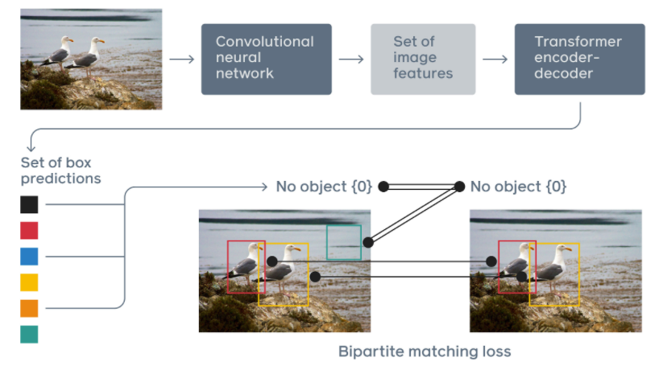
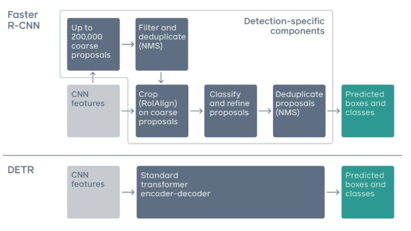

# Detection Transformers (DETR)

According to the [Facebook Research [1]](https://ai.facebook.com/research/publications/end-to-end-object-detection-with-transformers), DETR approaches object detection as a direct set prediction problem, unlike traditional computer vision techniques. It consists of a set-based global loss, which forces unique predictions via bipartite matching, and a Transformer encoder-decoder architecture. Given a fixed small set of learned object queries, DETR reasons about the relations of the objects and the global image context to directly output the final set of predictions in parallel. Due to this parallel nature, DETR is very fast and efficient.

## Using Transformer model for

[N. Carion et. al. [2]](https://ai.facebook.com/blog/end-to-end-object-detection-with-transformers) stated that [transformers [3]](https://arxiv.org/abs/1706.03762) are a deep learning architecture that has gained popularity in recent years. They rely on a simple yet powerful mechanism called attention, which enables AI models to selectively focus on certain parts of their input and thus reason more effectively. Transformers have been widely applied on problems with sequential data, in particular in natural language processing (NLP) tasks such as language modeling and machine translation, and have also been extended to tasks as diverse as speech recognition, symbolic mathematics, and reinforcement learning. But, perhaps surprisingly, computer vision has not yet been swept up by the Transformer revolution.

To help bridge this gap, Facebook Research released the Detection Transformers (DETR), which is an important new approach to object detection and panoptic segmentation. DETR completely changes the architecture compared with previous object detection systems. It is the first object detection framework to successfully integrate Transformers as a central building block in the detection pipeline.

DETR matches the performance of state-of-the-art methods, such as the well-established and highly optimized Faster R-CNN baseline on the challenging COCO object detection data set, while also greatly simplifying and streamlining the architecture.

DETR offers a simpler, more flexible pipeline architecture that requires fewer heuristics. Inference can be boiled down to 50 lines of simple Python code using elementary architectural blocks. Moreover, because Transformers have proven to be a powerful tool for dramatically improving performance of models in other domains, we believe additional performance gains and improved training efficiency will be possible with additional tuning.

## Reframing the task of Object Detection

DETR casts the object detection task as an image-to-set problem. Given an image, the model must predict an unordered set (or list) of all the objects present, each represented by its class, along with a tight bounding box surrounding each one.

This formulation is particularly suitable for Transformers. We chain a convolutional neural network (CNN), which extracts the local information from the image, with a Transformer encoder-decoder architecture, which reasons about the image as a whole and then generates the predictions.

Traditional computer vision models typically use a complex, partly handcrafted pipeline that relies on custom layers in order to localize objects in an image and then extract features. DETR replaces this with a simpler neural network that offers a true end-to-end deep learning solution to the problem.

The DETR framework consists of a set-based global loss, which forces unique predictions via bipartite matching, and a Transformer encoder-decoder architecture. Given a fixed small set of learned object queries, DETR reasons about the relations of the objects and the global image context to directly output the final set of predictions in parallel. Previous attempts to use architectures such as recurrent neural networks for object detection were much slower and less effective, because they made predictions sequentially rather than in parallel.

Transformers’ self-attention mechanisms allow DETR to perform global reasoning on the image as well as on the specific objects that are predicted. For example, the model may look at other regions of the image to help make a decision about the object in a bounding box. It can also make predictions based on relationships or correlations between objects in an image. If DETR predicts that an image contains a person standing on the beach, for example, it knows that a partially occluded object is more likely to be a surfboard. In contrast, other detection models predict each object in isolation.

We also demonstrate that this pipeline can be extended to related tasks such as [panoptic segmentation [4]](https://ai.facebook.com/blog/improving-scene-understanding-through-panoptic-segmentation/?ref=shareable), which aims at segmenting distinct foreground objects while simultaneously labeling all the pixels from the background. DETR treats foreground items, such as animals or people, and background items, such as sky or grass, in a truly unified manner.

## How to use

You could find the jupyter notebook about using DETR pretrained model for the object detection in [here](src/DETR_tutorial.ipynb). The codes in this notebook are referred to [this video](https://youtu.be/LfUsGv-ESbc). Credits to [Yannic Kilcher](https://www.youtube.com/channel/UCZHmQk67mSJgfCCTn7xBfew).

## Reference

[1] Nicolas Carion, Francisco Massa, Gabriel Synnaeve, Nicolas Usunier,Alexander Kirillov, and Sergey Zagoruyko. [End-to-End Object Detection with Transformers](https://ai.facebook.com/research/publications/end-to-end-object-detection-with-transformers)

[2] Nicolas Carion, Sergey Zagoruyko, Francisco Massa. [Facebook Research Tech Blog - End-to-end object detection with Transformers](https://ai.facebook.com/blog/end-to-end-object-detection-with-transformers)

[3] Ashish Vaswani, Noam Shazeer, Niki Parmar, Jakob Uszkoreit, Llion Jones, Aidan N. Gomez, Lukasz Kaiser, Illia Polosukhin. [Attention is all you need](https://arxiv.org/abs/1706.03762)

[4] Facebook Research. [panoptic segmentation](https://ai.facebook.com/blog/improving-scene-understanding-through-panoptic-segmentation/?ref=shareable)
