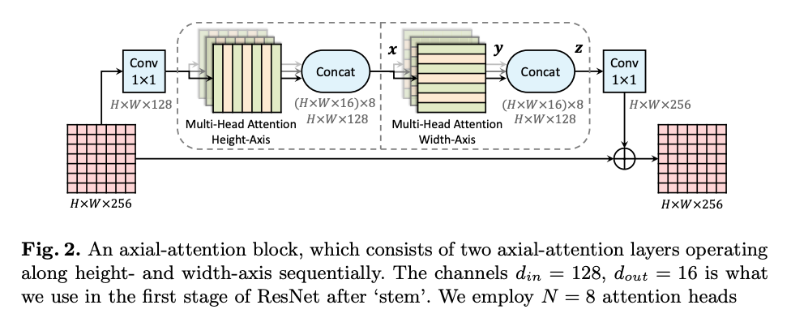

# Transformers for CV

## Axial-DeepLab

Convolutional Neural Networks have dominated image processing for the last decade, but transformers are quickly replacing traditional models. [Wang et al. [1]](https://arxiv.org/abs/2003.07853) proposes a fully attentional model for images by combining learned Positional Embeddings with Axial Attention. This new model can compete with CNNs on image classification and achieve state-of-the-art in various image segmentation tasks.

The key architiecture in this model is "Axial-Attention" block, which uses the "position sensitive attention". Wang et al. stated that the position sensitive attention  captures long range interactions with precise positional information at a reasonable computation overhead.

Surprisingly, the Axial-DeepLab worked well on not only for image classification, but also as a backbone of panoptic segmentation. For the image classification, it actually got similar accuracy score with other SOTA models that use ConvNet layers. Furthermore, it achieved SOTA for various segmentation tasks.

## DETR

On 2019, FAIR (Facebook AI Research) proposed a novel model called DETR, which uses the Transfomers model for the object detection.

Please see more information about the DETR in [here](../ObjectDetection/DETR)
