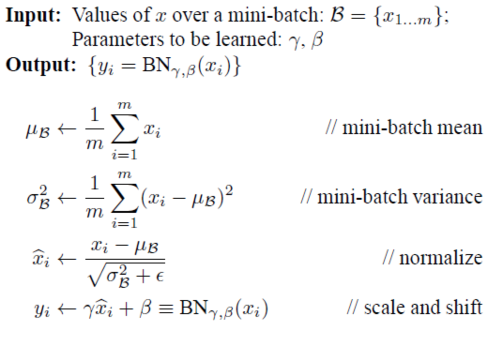
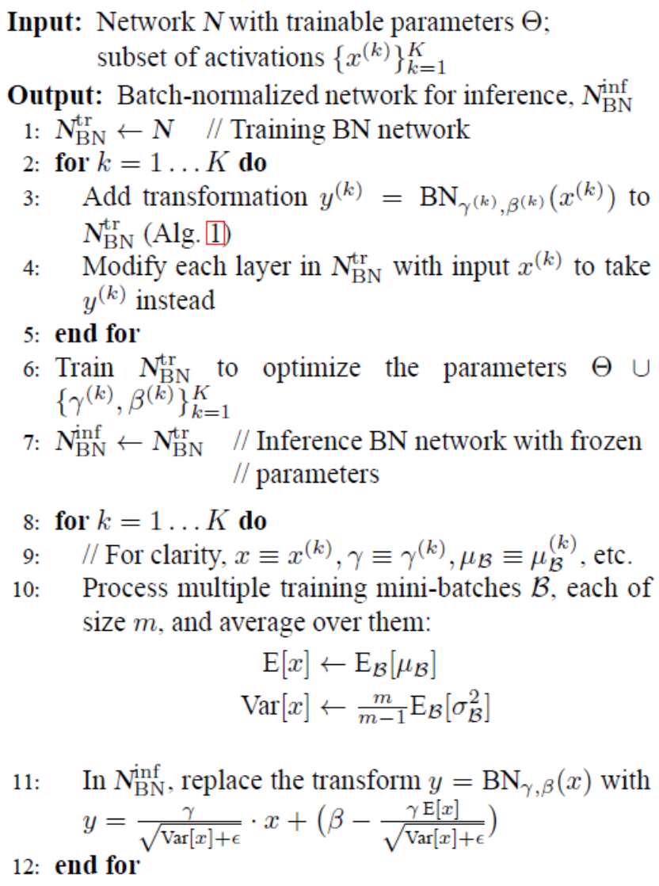

# Batch Normalisation

[Batch Normalisation (BN or batch norm) [1]](https://arxiv.org/abs/1502.03167) is a method used to make artificial neural networks faster and more stable through normalization of the input layer by re-centering and re-scaling.

## Motivation

Each layer of a neural network has inputs with a corresponding distribution, which is affected during the training process by the randomness in the parameter initialization and the randomness in the input data. The effect of these sources of randomness on the distribution of the inputs to internal layers during training is described as internal covariate shift. Although a clear-cut precise definition seems to be missing, the phenomenon observed in experiments is the change on means and variances of the inputs to internal layers during training.

Batch normalization was initially proposed to mitigate internal covariate shift. During the training stage of networks, as the parameters of the preceding layers change, the distribution of inputs to the current layer changes accordingly, such that the current layer needs to constantly readjust to new distributions. This problem is especially severe for deep networks, because small changes in shallower hidden layers will be amplified as they propagate within the network, resulting in significant shift in deeper hidden layers. Therefore, the method of batch normalization is proposed to reduce these unwanted shifts to speed up training and to produce more reliable models.

Besides reducing internal covariate shift, batch normalization is believed to introduce many other benefits. With this additional operation, the network can use higher learning rate without vanishing or exploding gradients. Furthermore, batch normalization seems to have a regularizing effect such that the network improves its generalization properties, and it is thus unnecessary to use dropout to mitigate overfitting. It has been observed also that with batch norm the network becomes more robust to different initialization schemes and learning rates.

## Advantages

- Batch normalization reduces the internal covariate shift (ICS) and accelerates the training of a deep neural network

- This approach reduces the dependence of gradients on the scale of the parameters or of their initial values which result in higher learning rates without the risk of divergence

- Batch Normalisation makes it possible to use saturating nonlinearities by preventing the network from getting stuck in the saturated modes

## Problems with Batch Normalisation

### Cannot apply to RNN

The batch normalisation performs the normalisation for each batch. However, the RNN uses the recurrence to predict sequence. Therefore, it is hard to apply the batch norm to the RNN.

To overcome this issue, layer norm was proposed. See [Layer Normalisation](../LayerNormalisation) for more information.

### Dependent on batch size

It was observed that the batch norm does not work properly when the batch size is too small.

To overcome this issue, [Group Normalization [2]](https://arxiv.org/abs/1803.08494v3) was proposed.

## References

[1] Sergey Ioffe, Christian Szegedy. [Batch Normalization: Accelerating Deep Network Training by Reducing Internal Covariate Shift](https://arxiv.org/abs/1502.03167)

[2] Yuxin Wu, Kaiming He. [Group Normalization](https://arxiv.org/abs/1803.08494v3)
