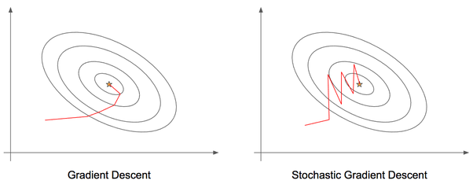
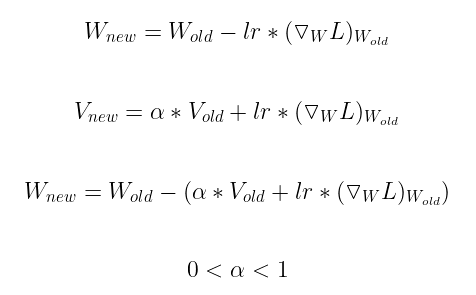
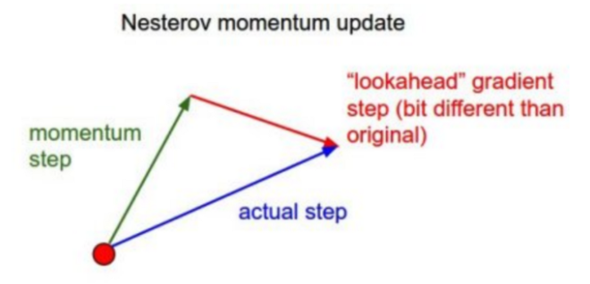

# Optimizer

Optimizers are algorithms or methods used to change the attributes of the neural network such as weights and learning rate to reduce the losses. Optimizers are used to solve optimization problems by minimizing the function.

## Table of Contents

1. [Role of the optimizer](#role-of-the-optimizer)
2. [How the optimizer works](#how-the-optimizer-works)
3. [Types of Optimizers](#types-of-optimizers)

## Role of the optimizer

Optimizers update the weight parameters to minimize the loss function. Loss function acts as guides to the terrain telling optimizer if it is moving in the right direction to reach the bottom of the valley, the global minimum.

## How the optimizer works

How you should change your weights or learning rates of your neural network to reduce the losses is defined by the optimizers you use. Optimization algorithms are responsible for reducing the losses and to provide the most accurate results possible.

The weight is initialized using some initialization strategies and is updated with each epoch according to the update equation.

The above equation is the update equation using which weights are updated to reach the most accurate result. The best result can be achieved using some optimization strategies or algorithms called optimizers.

Various optimizers are researched within the last few couples of years each having its advantages and disadvantages.

## Types of Optimizers

### Gradient Descent

_Gradient Descent (GD)_

Gradient descent is the most basic and first-order optimization algorithm which is dependent on the first-order derivative of a loss function. It calculates which way the weights should be altered so that the function can reach a minimum. Through backpropagation, the loss is transferred from one layer to another and the model’s parameters also known as weights are modified depending on the losses so that the loss can be minimized.

#### Advantages of GD

Very simple to implement

#### Disadvantages of GD

- This algorithm takes an entire dataset of n-points at a time to compute the derivative to update the weights which require a lot of memory.

- Minima is reached after a long time or is never reached.

- This algorithm can be stuck at local minima or saddle point

### Stochastic Gradient Descent

_Stochastic Gradient Descent (SGD)_

SGD algorithm is an extension of the GD algorithm and it overcomes some of the disadvantages of the GD algorithm. GD algorithm has a disadvantage that it requires a lot of memory to load the entire dataset of n-points at a time to computer derivative. In the case of the SGD algorithm derivative is computed taking one point at a time.

From the above diagram, it is observed that the updates take more number of iterations compared to gradient descent to reach minima. The GD algorithm takes fewer steps to reach minima but the SGD algorithm is noisier and takes more iterations.

#### Advantages of SGD

- Memory requirement is less compared to the GD algorithm as derivative is computed taking only 1 point at once.

#### Disadvantages of SGD

- The time required to complete 1 epoch is large compared to the GD algorithm.

- Takes a long time to converge.

- May stuck at local minima.

### Mini Batch Stochastic Gradient Descent

_Mini Batch Stochastic Gradient Descent (MB-SGD)_

MB-SGD algorithm is an extension of the SGD algorithm and it overcomes the problem of large time complexity in the case of the SGD algorithm. MB-SGD algorithm takes a batch of points or subset of points from the dataset to compute derivate.

It is observed that the derivate of the loss function for MB-SGD is almost the same as a derivate of the loss function for GD after some number of iterations. But the number of iterations to achieve minima is large for MB-SGD compared to GD and the cost of computation is also large.

The update of weight is dependent on the derivate of loss for a batch of points. The updates in the case of MB-SGD are much noisy because the derivative is not always towards minima.

#### Advantages of MB-SGD

- Less time complexity to converge compared to standard SGD algorithm.

#### Disadvantages of MB-SGD

- The update of MB-SGD is much noisy compared to the update of the GD algorithm.

- Take a longer time to converge than the GD algorithm.

- May get stuck at local minima.

#### Using GPU for accelerate training

The main advantage of using mini-batch SGD is the performance gains achieved using the hardware that is optimized for matrix operations. One of the most well-known hardware that is optimized for the matrix operations would be the "GPU".

As you know, by using GPU, we could accelerate the training of the neural network.

### Momentum

_Momenum_

Momentum is like a ball rolling downhill. The ball will gain momentum as it rolls down the hill.

Momentum helps accelerate Gradient Descent(GD) when we have surfaces that curve more steeply in one direction than in another direction. It also dampens the oscillation as shown above. For updating the weights it takes the gradient of the current step as well as the gradient of the previous time steps. This helps us move faster towards convergence. Convergence happens faster when we apply momentum optimizer to surfaces with curves.

#### SGD with Momentum

Basically, a major disadvantage of the MB-SGD algorithm is that updates of weight are very noisy. SGD with momentum overcomes this disadvantage by denoising the gradients. Updates of weight are dependent on noisy derivative and if we somehow denoise the derivatives then converging time will decrease.

The idea is to denoise derivative using exponential weighting average that is to give more weightage to recent updates compared to the previous update.

SGD update equation:

Momentum at time ‘t’ is computed using all previous updates giving more weightage to recent updates compared to the previous update. This lead to speed up the convergence.

### Nesterov Accelerated Gradient

_Nesterov Accelerated Gradient (NAG)_

Nesterov acceleration optimization is like a ball rolling down the hill but knows exactly when to slow down before the gradient of the hill increases again.

We calculate the gradient not with respect to the current step but with respect to the future step. We evaluate the gradient of the looked ahead and based on the importance then update the weights.

NAG is like you are going down the hill where we can look ahead in the future. This way we can optimize our descent faster. Works slightly better than standard Momentum.

### Adagrad

_Adaptive Gradient Algorithm (Adagrad)_

We need to tune the learning rate in Momentum and NAG which is an expensive process.

Adagrad is an adaptive learning rate method. In Adagrad we adopt the learning rate to the parameters. We perform larger updates for infrequent parameters and smaller updates for frequent parameters.

It is well suited when we have sparse data as in large scale neural networks. GloVe word embedding uses adagrad where infrequent words required a greater update and frequent words require smaller updates.

For SGD, Momentum, and NAG we update for all parameters θ at once. We also use the same learning rate η. In Adagrad we use different learning rate for every parameter θ for every time step t.

Adagrad eliminates the need to manually tune the learning rate.

In the denominator, we accumulate the sum of the square of the past gradients. Each term is a positive term so it keeps on growing to make the learning rate η infinitesimally small to the point that algorithm is no longer able learning. Adadelta, RMSProp, and adam tries to resolve Adagrad’s radically diminishing learning rates.

### Adadelta

_Adadelta_

- Adadelta is an extension of Adagrad and it also tries to reduce Adagrad’s aggressive, monotonically reducing the learning rate.

- It does this by restricting the window of the past accumulated gradient to some fixed size of w. Running average at time t then depends on the previous average and the current gradient.

- In Adadelta we do not need to set the default learning rate as we take the ratio of the running average of the previous time steps to the current gradient.

### RMSProp

_Root Mean Square Propagation (RMSProp)_

- RMSProp is Root Mean Square Propagation. It was devised by Geoffrey Hinton.

- RMSProp tries to resolve Adagrad’s radically diminishing learning rates by using a moving average of the squared gradient. It utilizes the magnitude of the recent gradient descents to normalize the gradient.

- In RMSProp learning rate gets adjusted automatically and it chooses a different learning rate for each parameter.

- RMSProp divides the learning rate by the average of the exponential decay of squared gradients

### Adam

_Adaptive Moment Estimation (Adam)_

- Another method that calculates the individual adaptive learning rate for each parameter from estimates of first and second moments of the gradients.

- It also reduces the radically diminishing learning rates of Adagrad

- Adam can be viewed as a combination of Adagrad, which works well on sparse gradients and RMSprop which works well in online and nonstationary settings.

- Adam implements the exponential moving average of the gradients to scale the learning rate instead of a simple average as in Adagrad. It keeps an exponentially decaying average of past gradients.

- Adam is computationally efficient and has very little memory requirement

- Adam optimizer is one of the most popular gradient descent optimization algorithms

#### How Adam works

Adam algorithm first updates the exponential moving averages of the gradient(mt) and the squared gradient(vt) which is the estimates of the first and second moment.

Hyper-parameters β1, β2 ∈ [0, 1) control the exponential decay rates of these moving averages as shown below

Moving averages are initialized as 0 leading to moment estimates that are biased around 0 especially during the initial timesteps. This initialization bias can be easily counteracted resulting in bias-corrected estimates.

Finally, we update the parameter as shown below.

### Nadam

_Nesterov-accelerated Adaptive Moment Estimation (Nadam)_

- Nadam combines NAG and Adam

- Nadam is employed for noisy gradients or for gradients with high curvatures

- The learning process is accelerated by summing up the exponential decay of the moving averages for the previous and current gradient
