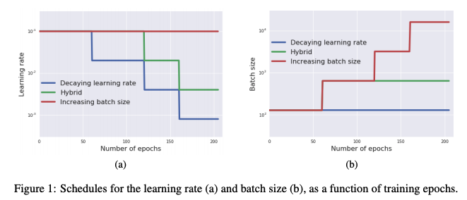

# Learning Rate

Learning Rate is a parameter of the Gradient Descent algorithm which helps us control the change of weights for our network to the loss of gradient. In other words, the learning rate is a tuning parameter in an optimization algorithm that determines the step size at each iteration while moving toward a minimum of a loss function. Since it influences to what extent newly acquired information overrides old information, it metaphorically represents the speed at which a machine learning model "learns".

The training of your model will progress very slowly if you keep your learning rate low as it would be making tiny adjustments to the weights in the network and it could also lead to overfitting. Whereas, when you set a high learning rate, the parametric function tend to have kinetic energy which makes it take huge leaps bouncing around chaotically, not letting it get narrower and deeper missing the local optima making the training diverge. But having a large learning rate helps in regularizing the model well to capture the true signal.

You can do a random grid search to find the optimal learning rate that converges but there are easier ways as it is computationally heavy and time-consuming.

## Table of Contents

1. [Changing the Learning Rate](#changing-the-learning-rate)
2. [Increase the Batch Size Rather than Decaying the Learning Rate](#increase-the-batch-size-rather-than-decaying-the-learning-rate)
3. [References](#references)

## Changing the Learning Rate

The "learning rate decaying" is a classic technique for training the neural network. It starts with a large learning rate and then decays it multiple times. It is empirically observed to help both optimization and generalization. Common beliefs in how "learning rate decaying" works come from the optimization analysis of (Stochastic) Gradient Descent: 1) an initially large learning rate accelerates training or helps the network escape spurious local minima; 2) decaying the learning rate helps the network converge to a local minimum and avoid oscillation.

Despite the popularity of these common beliefs, experiments suggest that they are insufficient in explaining the general effectiveness of "learning rate decaying" in training modern neural networks that are deep, wide, and nonconvex.

[K. You et. al. [1]](https://arxiv.org/abs/1908.01878) stated that "an initially large learning rate suppresses the network from memorizing noisy data while decaying the learning rate improves the learning of complex patterns".

### Learning Rate Schedule

The Learning Rate Schedule helps to adjust the learning rate while the training process by changing the learning rate through a predefined schedule. There are three variants of learning rate schedules such as time-based decay, exponential decay, and step decay.

### Constant Learning Rate

You can use the default learning rate while training the network, which you could use as a baseline to compare our performances and to get a rough idea of how the network is behaving. We can set the momentum and time decay as default which is zero.

### Adaptive Learning Rate Method

The drawback of using learning rate schedules is that you have to predefine the learning rates before the training process but we couldn’t choose the right ones with intuition as it depends totally on the model you have and the domain problem you are working on.

There are variants of Gradient Descent Algorithms that are adaptive in nature such as Adagrad, Adadelta, RMSprop, Adam in which the learning rate adapts on the kind of data it is dealing with (sparse, less sparse, etc) and it doesn’t require much of the manual work for tuning the learning rate.

### Cyclic Learning Rate

For using Cyclic Learning Rate, you need to define the minimum and maximum learning rate boundaries with the step size. The step size here is the number of epochs(iterations) taken for each step. The cycle consists of two kinds of step — one that linearly increases from minimum to maximum and the one that linearly decreases.

### Learning rate Range test

The training of the network by using the learning rate range test starts with a small learning rate which then linearly increases. You can obtain valuable information from it by a single run as when you choose a small learning rate, the cost function tends to converge well hitting the optima, but while increasing the learning rate, you will come across a threshold from which the validation loss starts increasing and the accuracy drops. That's how you get an idea about the optimal learning rate for our model and data

## Increase the Batch Size Rather than Decaying the Learning Rate

On 2018, Google Brain team published the paper [Don't Decay the Learning Rate, Increase the Batch Size [2]](https://arxiv.org/abs/1711.00489) at ICLR 2018. As you know, it is common practice to decay the learning rate. However, this paper shows that one can usually obtain the same learning curve on both training and test sets by instead increasing the batch size during training. By using this method, they were able to reach equivalent test accuracies after the same number of training epochs, but with fewer parameter updates, leading to greater parallelism and shorter training times.

Also, they mentioned that they can further reduce the number of parameter updates by increasing the learning rate and scaling the batch size. This means that by using the Hybrid method, which decays the learning rate and increases the batch size during the trainig, it would be able to train model well within shorter training time with fewer parameter updates.

## References

[1] Kaichao You, Mingsheng Long, Jianmin Wang, Michael I. Jordan. [How Does Learning Rate Decay Help Modern Neural Networks?](https://arxiv.org/abs/1908.01878)
[2] Samuel L. Smith, Pieter-Jan Kindermans, Chris Ying & Quoc V. Le [Don't Decay the Learning Rate, Increase the Batch Size](https://arxiv.org/abs/1711.00489)
